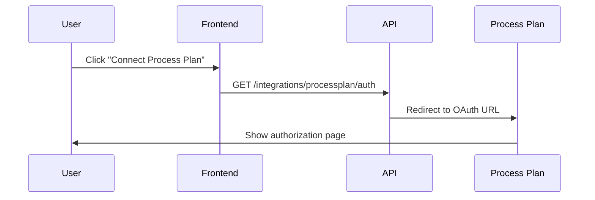
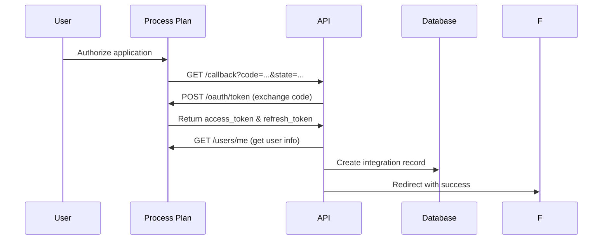
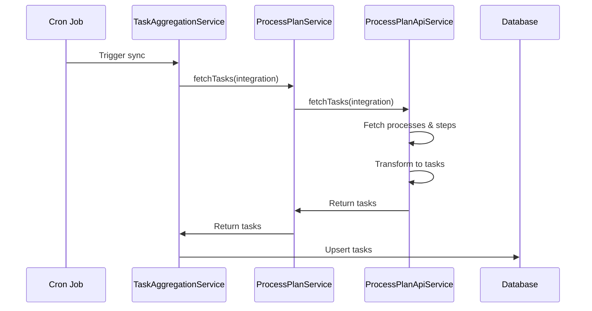

# Process Plan Integration API

This document describes the API endpoints for the Process Plan integration.

## Authentication Endpoints

### Initiate OAuth Flow

Starts the Process Plan OAuth2 authorization flow.

**Endpoint:** `GET /integrations/processplan/auth`

**Headers:**
- `Authorization: Bearer <jwt_token>` (required)

**Response:**
- **Success (302)**: Redirects to Process Plan OAuth URL
- **Error (500)**: Internal server error

**Example:**
```bash
curl -X GET \
  http://localhost:3001/integrations/processplan/auth \
  -H "Authorization: Bearer your_jwt_token"
```

### OAuth Callback

Handles the OAuth callback from Process Plan and creates the integration.

**Endpoint:** `GET /integrations/processplan/callback`

**Query Parameters:**
- `code` (string, required): Authorization code from Process Plan
- `state` (string, required): State parameter for CSRF protection
- `error` (string, optional): Error code if authorization failed

**Response:**
- **Success (302)**: Redirects to frontend with success message
- **Error (302)**: Redirects to frontend with error message

**Success Redirect:**
```
http://localhost:3000/integrations?success=true&provider=processplan
```

**Error Redirect:**
```
http://localhost:3000/integrations?error=oauth_failed&provider=processplan
```

## Data Structures

### Process Plan Task

Tasks created from Process Plan data include the following fields:

```typescript
interface ProcessPlanTask extends Task {
  // Process Plan-specific fields
  processPlanProcessId?: string;        // Process ID
  processPlanStepId?: string;           // Step ID (for step tasks)
  processPlanType: 'process' | 'step';  // Task type
  processPlanStatus: string;            // Original Process Plan status
  processPlanProgress?: number;         // Progress (0-1, processes only)
  processPlanOrder?: number;            // Step order (steps only)
  processPlanEstimatedDuration?: number; // Duration in minutes
  processPlanDependencies?: string[];   // Dependency step IDs
  processPlanTags?: string[];           // Process Plan tags
  processPlanAssignedTo?: string;       // Assigned user email
  processPlanProcessName?: string;      // Parent process name (steps only)
  processPlanTotalSteps?: number;       // Total steps (processes only)
  processPlanCompletedSteps?: number;   // Completed steps (processes only)
}
```

### Status Mapping

Process Plan statuses are mapped to Syntaskio task statuses:

| Process Plan Status | Syntaskio Status | Description |
|-------------------|------------------|-------------|
| `pending` | `pending` | Not yet started |
| `active` | `in_progress` | Currently active |
| `in_progress` | `in_progress` | In progress |
| `completed` | `completed` | Finished |
| `paused` | `pending` | Temporarily paused |
| `skipped` | `pending` | Skipped step |

## Integration Flow

### 1. User Initiates Connection



### 2. OAuth Authorization



### 3. Task Synchronization



## Error Handling

### OAuth Errors

| Error Code | Description | User Action |
|-----------|-------------|-------------|
| `access_denied` | User denied authorization | Try again |
| `invalid_request` | Malformed request | Contact support |
| `server_error` | Process Plan server error | Try again later |

### API Errors

| HTTP Status | Error Type | Description |
|------------|------------|-------------|
| 400 | `invalid_token` | Access token is invalid |
| 401 | `unauthorized` | Token expired or missing |
| 403 | `forbidden` | Insufficient permissions |
| 429 | `rate_limited` | Too many requests |
| 500 | `server_error` | Internal server error |

### Rate Limiting

The integration implements exponential backoff for rate limiting:

- Initial delay: 1 second
- Maximum delay: 60 seconds
- Backoff multiplier: 2
- Maximum retries: 5

## Configuration

### Environment Variables

| Variable | Required | Description | Example |
|----------|----------|-------------|---------|
| `PROCESSPLAN_CLIENT_ID` | Yes | OAuth client ID | `pp_client_123` |
| `PROCESSPLAN_CLIENT_SECRET` | Yes | OAuth client secret | `pp_secret_456` |
| `PROCESSPLAN_REDIRECT_URI` | Yes | OAuth redirect URI | `http://localhost:3001/integrations/processplan/callback` |
| `FRONTEND_URL` | Yes | Frontend base URL | `http://localhost:3000` |

### Process Plan App Setup

1. **Create OAuth App**
   - Go to Process Plan Developer Settings
   - Create new OAuth application
   - Set redirect URI to match `PROCESSPLAN_REDIRECT_URI`

2. **Required Scopes**
   - `read:processes` - Read process data
   - `read:steps` - Read step data
   - `read:user` - Read user profile

3. **Permissions**
   - Ensure the app has access to active processes
   - User must have read permissions for processes

## Testing

### Manual Testing

1. **Test OAuth Flow**
```bash
# Start the API server
npm run dev

# Navigate to auth endpoint
curl -H "Authorization: Bearer <token>" \
  http://localhost:3001/integrations/processplan/auth
```

2. **Test Task Sync**
```bash
# Trigger manual sync (requires integration)
curl -X POST \
  http://localhost:3001/integrations/sync \
  -H "Authorization: Bearer <token>" \
  -H "Content-Type: application/json" \
  -d '{"provider": "processplan"}'
```

### Automated Testing

```bash
# Run all Process Plan tests
npm test processplan

# Run specific test suites
npm test processplan.spec.ts           # Unit tests
npm test processplan-e2e.spec.ts       # E2E tests
npm test processplan-performance.spec.ts # Performance tests
```

## Monitoring

### Key Metrics

- **OAuth Success Rate**: Percentage of successful OAuth flows
- **Task Sync Rate**: Tasks synced per minute
- **API Response Time**: Average API call duration
- **Error Rate**: Percentage of failed API calls

### Logs to Monitor

- `[ProcessPlanService] Fetched X tasks from Process Plan`
- `[ProcessPlanApiService] Failed to fetch active processes`
- `[ProcessPlanAuthController] OAuth flow completed successfully`

### Alerts

Set up alerts for:
- High error rates (> 5%)
- Slow API responses (> 10s)
- OAuth failures
- Token refresh failures
